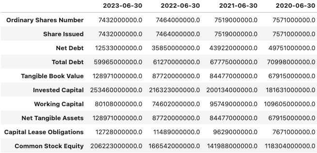

# Fundamental Analysis of a Company with Python 

Fundamental analysis involves evaluating whether a company is a worthwhile investment based on the current stock market 
and the global economy. It goes beyond complex formulas and ratios; it combines economic concepts and data analysis, 
allowing one to see beyond the numbers and identify real value in a company and its sector.

Financial data is dispersed across millions of websites, many of which are paid services with poor user experiences, 
making company analysis a challenging task.

One of the most well-known websites for stock analysis is Yahoo Finance. It provides a smooth user interface and all 
the data needed to perform comprehensive company analyses. Although Yahoo Finance no longer maintains an API for 
retrieving financial data, many open-source projects have emerged to fill this gap. One of the most notable projects 
is `yfinance`, which allows users to obtain stock data from Yahoo Finance, including *historical prices*, *balance sheets*,
*income statement*, *cash flow*, *dividends*, and more, using Python.

## Pre-requisites
The first step is to install all the packages needed, using `pip` command:
- `yfinance`
- `pandas`
- `matplotlib`

``` 
pip install yfinance
pip install pandas
pip install matplotlib
```

## Importing Data
The next step is to retrieve the financial data about a company. For this, `yfinance` offers the `Ticker` module, which allows
access to data by passing the ticker identifier as an argument. 

The `Ticker` module returns an object that contains many properties, such as `info`, `history`, `dividends`, `income_stmt`,
`balance_sheet`, `cashflow`, and more. These properties provide access to the most important financial data about a company.

```python
import yfinance as yf

ticker = "MSFT"
company = yf.Ticker(ticker)

```

## Stock Information
Details about the company can be access through the `info` property. This property returns a dictionary with 132 keys containing
basic company's information such as:
- Name
- Country
- Business summary
- Industry and sector
- Constitution of the board of directors
- Commonly used ratios like EPS, Dividend Yield, P/E, Payout Ratio, Market Capitalisation, and more.

This is the complete list of all keys:
```python
[
    "address1",
    "city",
    "state",
    "zip",
    "country",
    "phone",
    "website",
    "industry",
    "industryKey",
    "industryDisp",
    "sector",
    "sectorKey",
    "sectorDisp",
    "longBusinessSummary",
    "fullTimeEmployees",
    "companyOfficers",
    "auditRisk",
    "boardRisk",
    "compensationRisk",
    "shareHolderRightsRisk",
    "overallRisk",
    "governanceEpochDate",
    "compensationAsOfEpochDate",
    "irWebsite",
    "maxAge",
    "priceHint",
    "previousClose",
    "open",
    "dayLow",
    "dayHigh",
    "regularMarketPreviousClose",
    "regularMarketOpen",
    "regularMarketDayLow",
    "regularMarketDayHigh",
    "dividendRate",
    "dividendYield",
    "exDividendDate",
    "payoutRatio",
    "fiveYearAvgDividendYield",
    "beta",
    "trailingPE",
    "forwardPE",
    "volume",
    "regularMarketVolume",
    "averageVolume",
    "averageVolume10days",
    "averageDailyVolume10Day",
    "bid",
    "ask",
    "bidSize",
    "askSize",
    "marketCap",
    "fiftyTwoWeekLow",
    "fiftyTwoWeekHigh",
    "priceToSalesTrailing12Months",
    "fiftyDayAverage",
    "twoHundredDayAverage",
    "trailingAnnualDividendRate",
    "trailingAnnualDividendYield",
    "currency",
    "enterpriseValue",
    "profitMargins",
    "floatShares",
    "sharesOutstanding",
    "sharesShort",
    "sharesShortPriorMonth",
    "sharesShortPreviousMonthDate",
    "dateShortInterest",
    "sharesPercentSharesOut",
    "heldPercentInsiders",
    "heldPercentInstitutions",
    "shortRatio",
    "shortPercentOfFloat",
    "impliedSharesOutstanding",
    "bookValue",
    "priceToBook",
    "lastFiscalYearEnd",
    "nextFiscalYearEnd",
    "mostRecentQuarter",
    "earningsQuarterlyGrowth",
    "netIncomeToCommon",
    "trailingEps",
    "forwardEps",
    "pegRatio",
    "lastSplitFactor",
    "lastSplitDate",
    "enterpriseToRevenue",
    "enterpriseToEbitda",
    "52WeekChange",
    "SandP52WeekChange",
    "lastDividendValue",
    "lastDividendDate",
    "exchange",
    "quoteType",
    "symbol",
    "underlyingSymbol",
    "shortName",
    "longName",
    "firstTradeDateEpochUtc",
    "timeZoneFullName",
    "timeZoneShortName",
    "uuid",
    "messageBoardId",
    "gmtOffSetMilliseconds",
    "currentPrice",
    "targetHighPrice",
    "targetLowPrice",
    "targetMeanPrice",
    "targetMedianPrice",
    "recommendationMean",
    "recommendationKey",
    "numberOfAnalystOpinions",
    "totalCash",
    "totalCashPerShare",
    "ebitda",
    "totalDebt",
    "quickRatio",
    "currentRatio",
    "totalRevenue",
    "debtToEquity",
    "revenuePerShare",
    "returnOnAssets",
    "returnOnEquity",
    "freeCashflow",
    "operatingCashflow",
    "earningsGrowth",
    "revenueGrowth",
    "grossMargins",
    "ebitdaMargins",
    "operatingMargins",
    "financialCurrency",
    "trailingPegRatio",
]
```

## Historical Prices
Historical prices can be access through `history` property by passing arguments according to time specifications, resulting in
a `pandas` Dataframe.

The resulting Dataframe contains the following columns:
- `Date`
- `Open`
- `High`
- `Low`
- `Close`
- `Volume`
- `Dividends`
- `Stock Splits`

In the following example, the resulting Dataframe contains historical prices from the first day of the company's public offering
until today, with daily granularity. 

```python
historical_prices = company.history(period="max", interval="1d")
historical_prices.head(10)
```


## Balance Sheet
Balance sheet can be access through `balance_sheet` property. This property returns a `pandas` Dataframe containing 4 columns,
representing the dates of annual results' release; and 73 columns with all details about assets and liabilities.

```python
balance_sheet = company.balance_sheet
balance_sheet.head(10)
```


This is the complete list of fields:
```python
[
    "Ordinary Shares Number",
    "Share Issued",
    "Net Debt",
    "Total Debt",
    "Tangible Book Value",
    "Invested Capital",
    "Working Capital",
    "Net Tangible Assets",
    "Capital Lease Obligations",
    "Common Stock Equity",
    "Total Capitalization",
    "Total Equity Gross Minority Interest",
    "Stockholders Equity",
    "Gains Losses Not Affecting Retained Earnings",
    "Other Equity Adjustments",
    "Retained Earnings",
    "Capital Stock",
    "Common Stock",
    "Total Liabilities Net Minority Interest",
    "Total Non Current Liabilities Net Minority Interest",
    "Other Non Current Liabilities",
    "Tradeand Other Payables Non Current",
    "Non Current Deferred Liabilities",
    "Non Current Deferred Revenue",
    "Non Current Deferred Taxes Liabilities",
    "Long Term Debt And Capital Lease Obligation",
    "Long Term Capital Lease Obligation",
    "Long Term Debt",
    "Current Liabilities",
    "Other Current Liabilities",
    "Current Deferred Liabilities",
    "Current Deferred Revenue",
    "Current Debt And Capital Lease Obligation",
    "Current Debt",
    "Pensionand Other Post Retirement Benefit Plans Current",
    "Payables And Accrued Expenses",
    "Payables",
    "Total Tax Payable",
    "Income Tax Payable",
    "Accounts Payable",
    "Total Assets",
    "Total Non Current Assets",
    "Other Non Current Assets",
    "Investments And Advances",
    "Long Term Equity Investment",
    "Goodwill And Other Intangible Assets",
    "Other Intangible Assets",
    "Goodwill",
    "Net PPE",
    "Accumulated Depreciation",
    "Gross PPE",
    "Leases",
    "Other Properties",
    "Machinery Furniture Equipment",
    "Buildings And Improvements",
    "Land And Improvements",
    "Properties",
    "Current Assets",
    "Other Current Assets",
    "Hedging Assets Current",
    "Inventory",
    "Finished Goods",
    "Work In Process",
    "Raw Materials",
    "Receivables",
    "Accounts Receivable",
    "Allowance For Doubtful Accounts Receivable",
    "Gross Accounts Receivable",
    "Cash Cash Equivalents And Short Term Investments",
    "Other Short Term Investments",
    "Cash And Cash Equivalents",
    "Cash Equivalents",
    "Cash Financial",
]
```


## Income Statement

## Cash Flow

## Ratios